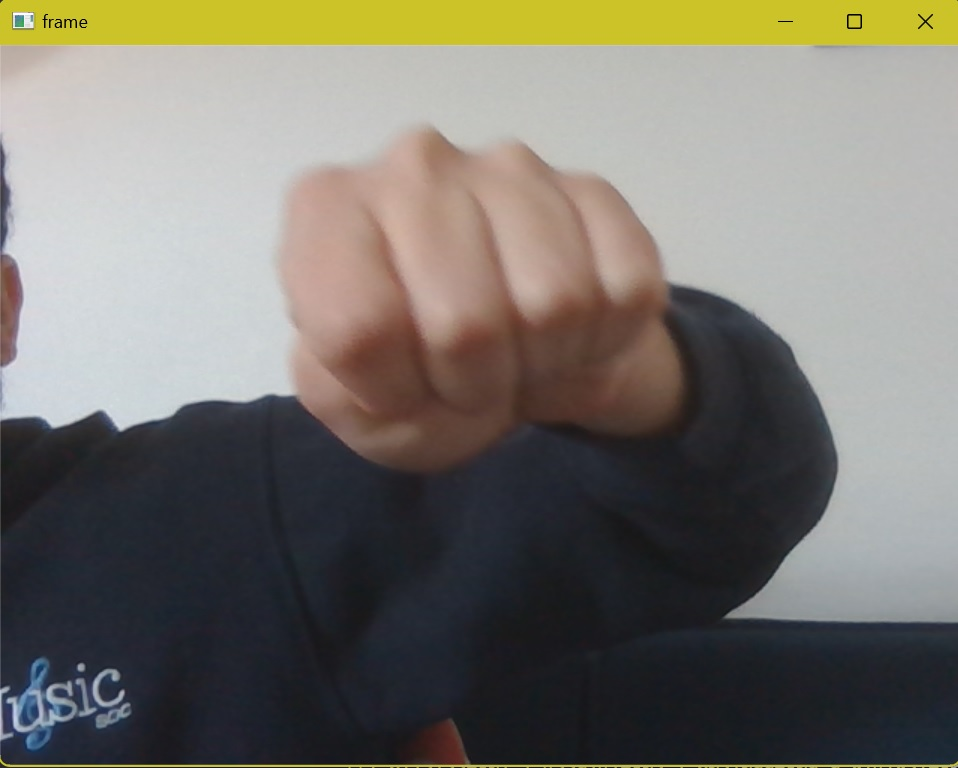

# Computer Vision RPS

## The Project

So in this project my goal is going to be to create a programme which allows you to play rock paper scissors using webcam. Utilising a teachable modelling programme, I'm going to train the model how to look at different hand positions to read what gesture the user is pulling. After that I'll incorporate multiple rounds of play and determine who the winner is of a game.

## First Steps

So as a part of this computer vision project I've firstused https://teachablemachine.withgoogle.com/train/image to make an image recognition model recognising 4 different states:

1. Rock (Hands in a balled up position)

2. Paper (Palm flat, fingers pointed out)

3. Scissors (index and middle fingers extender, else balled fist)

and
4. Nothing (no hands in shot)

I've exported this data into a labels and keras model h5 file.

## Next Step: Enviroment 

So in order to integrate the Keras model I've included a python file which can read the keras model data. When the code is run, given a web cam integration, a new window appears with web cam open and begins intepretting the data on the catergories previously stated in an array format. On this Array we get values between 0-1 for each of our catergories (in order) to represent a percentage confidennce that this image matches the catergories previous trained; the closer to zero being more unlikly to be within that catergory and with values closer to 1 being entirly likely to within the catergory.

To do this we had import numpy, opencv-python and tenderflow to be able to intrepet this data and make sure the version of python being used was able to integrate with these models. As a result we're currently using 3.9.16.

## Next Step: Setting up Rock-Paper-Scissors Concept

I've defined some basic functions to play a game of Rock Paper Scissors in a computer vs user format.

For the computer I've defined a list of basic valid inputs from which is can choose from and then used a randomiser to select one of these options when playing:

```
def get_computer_choice():
  valid_inputs = ["Rock", "Paper", "Scissors"]
  computer_choice = random.choice(valid_inputs)
  return(computer_choice) 

```

For the user, I've taken their input but then additional had a check against that same list to make sure that the input is also from that list. If not they need to type it in again and a message is displayed asking them to consider capitalisation of the word as I assume this would be a common error. And as addition I've added it in a while loop so that the user is prompted to reinput until they have a correct selection. 

This will be easy to adjust later

```

def get_user_choice():
 valid_inputs = ["Rock", "Paper", "Scissors"]
 while True:
    user_choice = (input("player input "))
    if user_choice not in valid_inputs:
     print("invalid input. Make sure your first letter is capitalised")
    else: 
     return(user_choice)

```

Following this I've created a basic set up of the game, defining a win, tie and lose condition for the user playing.
I've encapuslated this in a get_winner function.

```

def get_winner(computer_choice, user_choice):
 if user_choice == computer_choice:
    print("It is a tie!")
 elif (computer_choice == "Rock" and user_choice == "Paper") or (computer_choice == "Paper" and user_choice == "Scissors") or (computer_choice == "Scissors" and user_choice == "Rock"):
    print("You won!")
 else:
    print("You lost")

```

Finally, I've added all this into a higher level function which takes all three functions into one group called play

`def play():
  get_winner(get_computer_choice(), get_user_choice())`

## Next Step: Integrating models

So integrating the webcam view took X steps:

Step 1
  
  One was creating a camera_read function which could utilise a webcam and then predict (read to it's best ability) the hand gesture.
  This function repeats a process of creating a predictive array (as explained in enviroments)
  To end this process once a gesture has been determined there's is 'q' order (for quit) to exit
  In this instance the last array would be the one used in our next step however, to make it more Rock Paper Scissors Like, I put in a condition of allowing only 7 second script time on a run of the camera_read function to take in the information before it would automatically exit and again take the last array

  

Step 2

  Following this I made a get_prediction. This function takes from the last array, which is assigned prediction, and takes the index of the max value. Why do this? The max value in this instance it the most probable outcome of the users hand gesture so is thus what is determined to be their input.
  After it looks at the list of catergories which are in an order to match the order of the categories set in the keras model to return from the function one of "Rock", "Paper", "Scissors"  or "Nothing".

  ```
  def get_prediction():
  Model_Catergory_Order = ["Rock", "Paper", "Scissors", "Nothing"]
  max_value_of_array_index = np.argmax(camera_read())
  return Model_Catergory_Order[max_value_of_array_index]
  ```

Step 3

   We then replace our initial user_choice in our RPS model above, with instead of input, a call to get prediction.
   The surrounding validity checks are no longer necessary as the outcomes are fixed in terminology. However we do print "You chose {user_choice}" to confirm to the user what they have selected.

   ```
   def get_user_choice():
    user_choice = get_prediction()
    print(f'you chose {user_choice}')
    return(user_choice)
   ```

Following this the model works as our manual RPS model above.

## Next Step: Setting Conditions for winning

After this I adpated the play function to include a 3 win condition for winning overall rock paper scissors. Creating a while loop on the conditions of 3 wins by either party (user or cmoputer) as the means to break the loop. I also added in, in each instance a total wins for each player so they can see how close it was.

```
def play():
  user_wins = 0
  computer_wins = 0
  while user_wins < 3 or computer_wins < 3:
    if user_wins == 3:
        print("User has won overall")
        print(f"User Final Score {user_wins}")
        print(f"Computer Final Score {computer_wins}")
        break
    elif computer_wins == 3:
        print("Computer has won overall")
        print(f"User Final Score {user_wins}")
        print(f"Computer Final Score {computer_wins}")
        break
    result = get_winner(get_computer_choice(), get_user_choice())
    if result == "it is a tie":
        continue
    elif result == "user_wins":
         user_wins += 1
    else:
         computer_wins += 1
   ```


